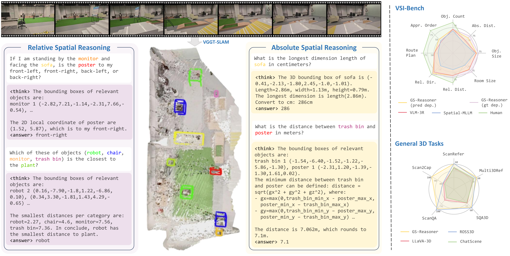

# Reasoning in Space via Grounding in the World

We present **Grounded-Spatial Reasoner (GS-Reasoner)**, the first 3D-LLM that bridges 3D visual grounding and spatial reasoning. 

Our model achieves state-of-the-art performance on [VSI-Bench](https://github.com/vision-x-nyu/thinking-in-space)! 🚀

[Yiming Chen](yiming-cc.github.io), [Zekun Qi](https://qizekun.github.io/), [Wenyao Zhang](https://zhangwenyao1.github.io/), [Xin Jin](https://jinx-ustc.github.io/jinxin.github.io/), [Li Zhang](https://lzrobots.github.io/), [Peidong Liu](https://ethliup.github.io/)

[](https://yiming-cc.github.io/gs-reasoner/)
[](https://arxiv.org/pdf/2510.13800)
[](https://huggingface.co/collections/ymccccc/gs-reasoner-68efc95783fb92bb44269f7a)
[](https://github.com/tatsu-lab/stanford_alpaca/blob/main/LICENSE)
[](https://github.com/tatsu-lab/stanford_alpaca/blob/main/DATA_LICENSE)

<div style="text-align: center;">
    
</div>


<!-- ## Contents -->
<!-- - [Quick Start](#quick-start)
- [Model Weights](#model-weights)
- [Training](#training)
- [Evaluation](#evaluation)
- [TODO](#todo)
- [Citation](#citation) -->

## Setup
```bash
conda create -n gs-reasoner python=3.11 -y
conda activate gs-reasoner

git clone git@github.com:WU-CVGL/GS-Reasoner.git
cd GS-Reasoner

# install package for GS-Reasoner
pip install -e .

# (optional) opencv-python extral dependency
sudo apt update
sudo apt install -y libgl1 libglib2.0-0 libsm6 libxext6 libxrender1

# (optional) install gcc
conda install -c conda-forge gcc=13.2 gxx=13.2 -y

# (optional) install cuda toolkit 12.4
wget https://developer.download.nvidia.com/compute/cuda/repos/ubuntu2204/x86_64/cuda-keyring_1.1-1_all.deb
sudo dpkg -i cuda-keyring_1.1-1_all.deb
sudo apt-get update
sudo apt-get -y install cuda-toolkit-12-4

# install package for Sonata
cd llava/submodules/sonata
pip install -r requirements.txt
cd ../../..

# install package for VSI-Bench Evaluation
cd llava/submodules/lmms_eval
pip install -r requirements.txt
cd ../../..
```


## Model Weights
We provide two pretrained model checkpoints:

* **[GS-Reasoner](https://huggingface.co/ymccccc/GS-Reasoner)** – the main model used in our paper, producing more deterministic chain-of-thought reasoning.
* **[GS-Reasoner-Diverse](https://huggingface.co/ymccccc/GS-Reasoner-Diverse)** – a variant that generates more diverse chain-of-thought outputs with only a minor performance drop (less than 1.0 on VSI-Bench).

To use them, download the checkpoints and place them under the `data/models` directory.

<!-- ## Grounded Chain-of-Thought (GCoT) Dataset -->

## Data Preprocessing
For data preprocessing, please refer to this [instruction](scripts/3d/preprocessing/README.md) for detail.

### VSI-Bench Evaluation data
In addition, we provide the **depth**, **camera parameters**, **axis alignment matrices**, and **global scale factors** (for metric evaluation) estimated using [VGGT-SLAM](https://github.com/MIT-SPARK/VGGT-SLAM) and [MoGe-2](https://github.com/microsoft/MoGe).  The processed data can be accessed at [ymccccc/vggt_slam_processed_data](https://huggingface.co/datasets/ymccccc/vggt_slam_processed_data) and are used for **VSI-Bench** evaluation. To use it, download the evaluation data and place it under the `data/` directory. Before running the evaluation, please create a soft link to the color directory for each scene dataset as follows:
```bash
# example
cd data/vggt_slam_processed_data/arkitscenes
ln -s data/processed_data/arkitscenes/color ./
```

### Training Data
The training data — including **3D visual grounding**, **general 3D tasks**, and the **Grounded Chain-of-Thought dataset** — are available [here](https://huggingface.co/datasets/ymccccc/GS-Reasoner-Data). To use it, download the data and place it under `data/` directory. Note: We replace the appearance order data in GCoT with that provided by [ViCA](https://github.com/nkkbr/ViCA), which we find leads to slightly improved performance. We sincerely thank the [ViCA](https://github.com/nkkbr/ViCA) authors for their excellent open-source work.


## Training
GS-Reasoner is trained end-to-end for next-token prediction. We first pretrain the model on subsets of 3D visual grounding datasets — including ScanRefer, Multi3DRef, SR3D, and NR3D, among others — to warm up its object grounding capability. Subsequently, we finetune the model on our proposed GCoT dataset, the remaining grounding data, and other 3D reasoning tasks such as ScanQA, SQA3D, and Scan2Cap.

To train GS-Reasoner, first prepare all data following the instructions in [Data Preprocessing](#data-preprocessing). Then, download the pretrained checkpoints for the following models and place them under `data/models`: [LLaVA-Video-7B-Qwen2](https://huggingface.co/lmms-lab/LLaVA-Video-7B-Qwen2), [Sonata](https://huggingface.co/ymccccc/sonata-wo-normal) and [SigLIP](https://huggingface.co/google/siglip-so400m-patch14-384).

Once the setup is complete, run the following scripts to train GS-Reasoner:
```bash
# Pretrain
bash train_multi_pretrain.sh

# Finetune
bash train_multi_finetune.sh
```


## Evaluation
Run following scripts to evaluate GS-Reasoner:
```bash
# evaluate on VSI-Bench
bash eval_vsibench.sh   

# evaluate on 3d visual grounding
bash eval_3d_vg.sh

# evaluate on generate 3d tasks
bash eval_general_3d.sh
```


## TODO
- [x] Release detailed data preprocessing scripts.  
- [x] Release the Grounded Chain-of-Thought dataset.
- [x] Release processed data for general 3D tasks (e.g., ScanRefer, ScanQA, etc.).
- [x] Release training script.


## Acknowledgements
* [Sonata](https://github.com/facebookresearch/sonata)
* [Video-3D-LLM](https://github.com/LaVi-Lab/Video-3D-LLM/tree/main)
* [VLM-3R](https://github.com/VITA-Group/VLM-3R)
* [VGGT-SLAM](https://github.com/MIT-SPARK/VGGT-SLAM)
* [MoGe](https://github.com/microsoft/MoGe)


## Citation
```BibTex
@misc{chen2025reasoningspacegroundingworld,
      title={Reasoning in Space via Grounding in the World}, 
      author={Yiming Chen and Zekun Qi and Wenyao Zhang and Xin Jin and Li Zhang and Peidong Liu},
      year={2025},
      eprint={2510.13800},
      archivePrefix={arXiv},
      primaryClass={cs.CV},
      url={https://arxiv.org/abs/2510.13800}, 
}
```